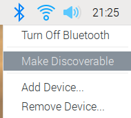
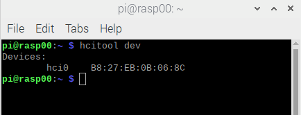

===============================================
Raspberry Pi Time-lapse coordinator
===============================================

:Author: Olivier Friard

The raspberry_time-lapse_coordinator is a framework to organize time-lapse experiments with Raspberry Pi devices.

The Raspberry Pi devices (workers) are controlled by a laptop/desktop (coordinator) using the bluetooth protocol.
No wired/wireless TCP/IP connection is required.

The raspberry_time-lapse_coordinator framework is developed in Python3 and have few dependencies (pybluez and PyQt5).

You must have almost one Raspberry Pi device with a Camera module installed and a laptop/desktop computer
(or another Rasberry Pi device can be used in replacement).

Installation
=============================

Before installation you must pair all your Raspberry Pi devices with the laptop/desktop:

* Make your Raspberry Pi device discoverable. The bluetooth icon will blink green/blue.

* Search bluetooth devices with your laptop/desktop 

* Ask to pair each Raspberry Pi device. You will have to accept the pairing on your Raspberry Pi device.

* Set Trust to each Raspberry Pi device on your laptop/desktop

You have to install some packages on the laptop/desktop (coordinator) and the Raspberry Pi devices (workers):

.. code-block:: text

    sudo apt install bluetooth libbluetooth-dev

Setting the workers (the Raspberry Pi devices)
-------------------------------------------------------

The Python scripts in the src/worker directory (bluetooth_worker.py, config.py and start_bluetooth_worker.bash) must be copied on the Raspberry Pi devices.
You can create the /home/pi/projects/time_lapse directory and copy these scripts into.

Creating a Python virtual environment
............................................

In order to install the Python dependencies the best practice is to create a new Python virtual environment:

.. code-block:: text

   python3 -m venv timelapse_worker
   source timelapse_worker/bin/activate
   python3 -m pip install pybluez

Launching the program on the worker
.............................................

The worker program can be launched with the following commands:

.. code-block:: text

    source timelapse_worker/bin/activate
    cd /home/pi/projects/time_lapse
    python3 bluetooth_worker.py

If the workers do not have a display/keyboard/mouse it can be useful to automatically launch the program when the Raspberry starts:
For this yu have to modify the /etc/rc.local file:

.. code-block:: text

    sudo nano /etc/rc.local

Add the following line BEFORE the last line (exit 0)

.. code-block:: text

    sudo su - pi /home/pi/projects/time_lapse/start_bluetooth_worker.bash &

Setting the coordinator (the laptop/desktop)
-------------------------------------------------------

The Python scripts in the src/coordinator directory (bluetooth_coordinator.py and config_coordinator.py) must be copied on laptop/desktop.
You can create a dedicated directory like /home/USERNAME/projects/time_lapse and copy these scripts into.

Creating a Python virtual environment
............................................

In order to install the Python dependencies the best practice is to create a new Python virtual environment:

.. code-block:: text

   python3 -m venv timelapse_worker
   source timelapse_worker/bin/activate
   python3 -m pip install pyqt5 pybluez

Setting the coordinator program
............................................

The list of the Raspberry Pi devices must be updated in the config_coordinator.py file.

Every Raspberry Pi device in the list must have an id. The best practice is to use the Raspberry Pi hostname.

The Raspberry Pi hostname can be changed with the following command:

.. code-block:: text

    sudo nano /etc/hostname

The change will take effect after rebooting your device.

Every Raspberry Pi device in the list must have its bluetooth MAC Address.
You can obtain the Raspberry Pi bluetooth MAC address with the following command:

.. code-block:: text

    hcitool dev

Example of config_coordinator.py file:

.. code-block:: text

    # raspberries list with bluetooth MAC address
    RASPBERRY_LIST  = {
        "rasp00": "b8:27:eb:0b:06:8c",
        "rasp01": "b8:27:eb:42:d2:32",
    }

Launching the program on the coordinator
.............................................

The coordinator program can be launched with the following commands:

.. code-block:: text

    source timelapse_worker/bin/activate
    cd /home/USERNAME/projects/time_lapse
    python3 bluetooth_coordinator.py

If the workers are running the worker program you should visualize a graphic interface like this:

In this case 2 workers (rasp00 and rasp01) are waiting to receive commands from the coordinator program.

If the **Sync time** button is not green the time on the Raspberry Pi device is not set correctly.
You can click the button to synchronize the time between the coordinator and the worker
(the coordinator time will be sent to the Rasberry Pi).

Setting a time-lapse experiment
===============================================

Launch the Raspberry Pi devices.

Launch the coordinator program.

